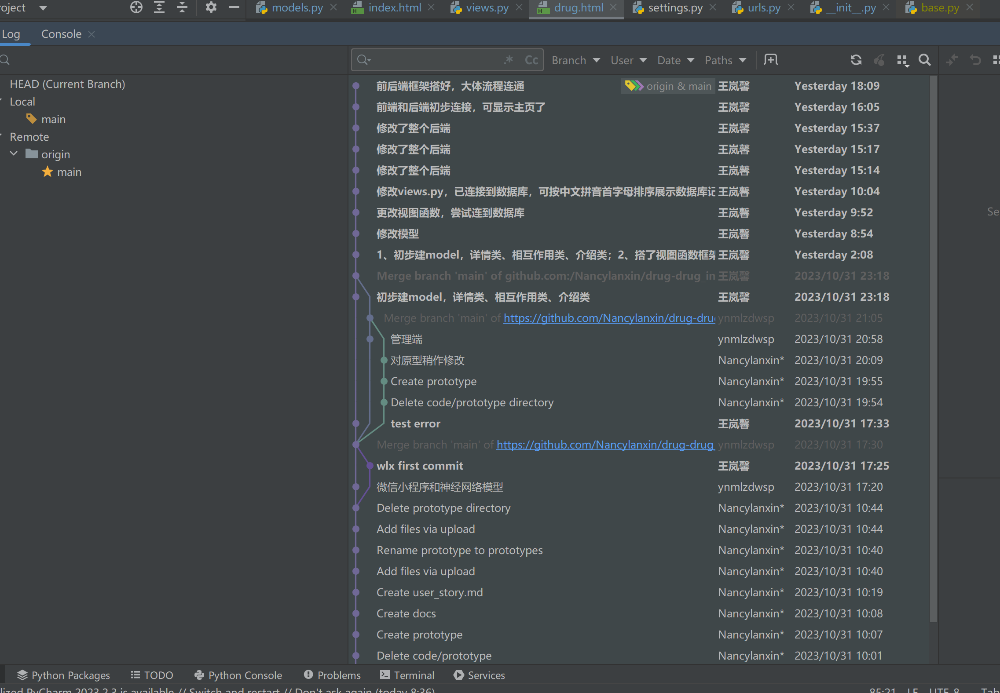

我们的药药相互平台帮助用户查询和预测多种药物之间的相互作用
| 项目模块  | 编程语言 | 编程工具 | 版本号  |
|--------|------|------|------|
| 后台管理系统前端   | VUE   | Visual Stdio Code | 1.84.0 |
| 后台管理系统后端   | SpringBoot   | IntelliJ IDEA   |  2023.1.2 |
| 微信小程序   | JavaScript   | 微信开发者工具 | 1.0 |
| 微信小程序   | JavaScript   | 微信开发者工具 | 1.0 |
| 微信小程序   | JavaScript   | 微信开发者工具 | 1.0 |

代码仓库链接：
https://github.com/Nancylanxin/drug-drug_interaction.git

项目提交截图：
